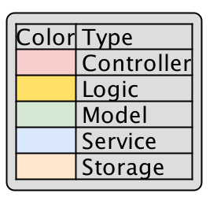
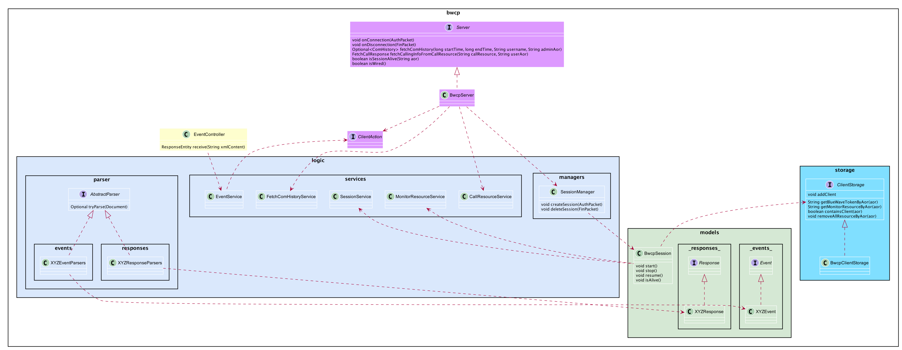
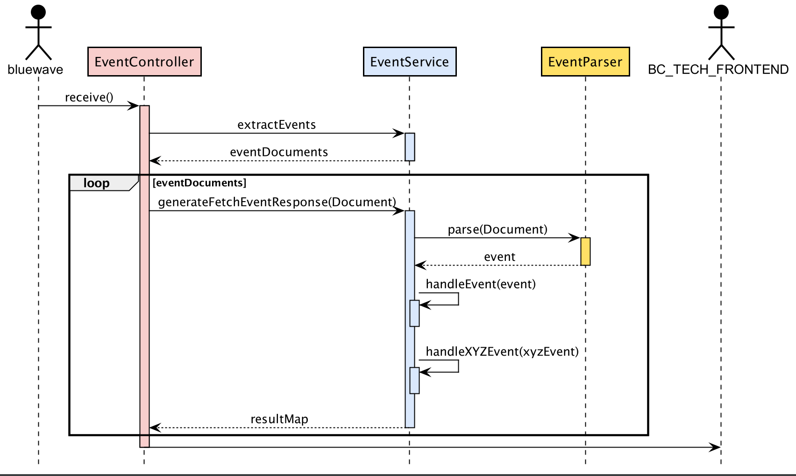
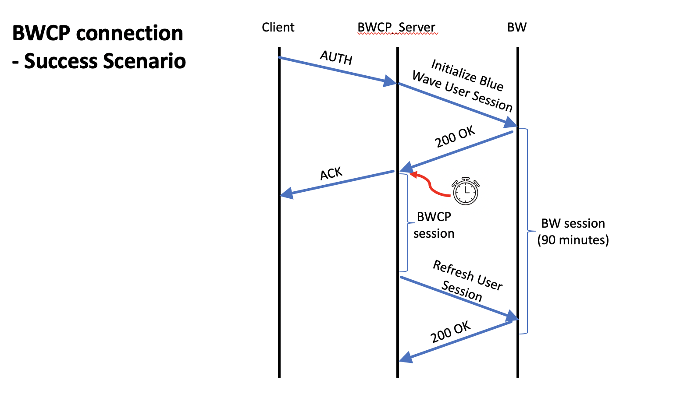
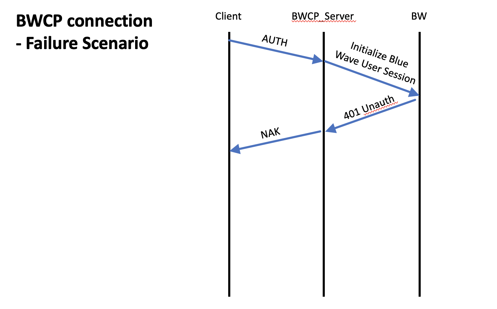
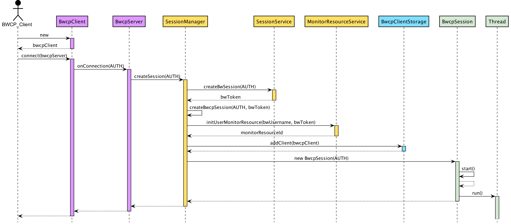
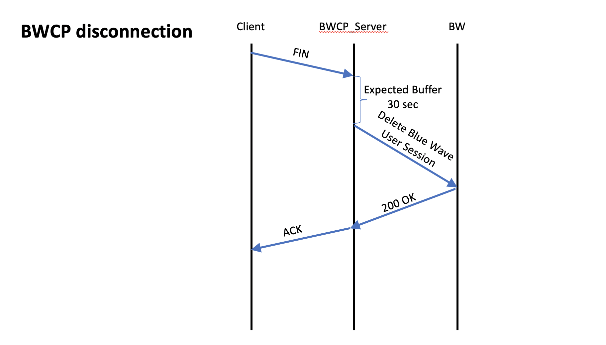

* Table of Contents
{:toc}

---

# BC-TECH - Developer Guide

By: Eddy

&nbsp;

## **1. Introduction**

This document is a Developer Guide written for developers/maintainer who wish to extend or maintain the project. It is technical, and explains the inner workings of BC-TECH and how the different components of our application work together.

**Reading this Developer Guide**

| Icon | Remarks                                                                 |
|:----:|-------------------------------------------------------------------------|
|   💡  | This icon denotes useful tips to note of during development.            |
|   ❗️  | This icon denotes important details to take note of during development. |

The diagrams in this Developer Guide are colour coded according to the different components.

&nbsp;

## **2. Architecture**

### **2.11 Blue Wave Connection Protocol (BWCP) architecture**

## **3. Implementation**

### **3.1. Information Collector**

### **3.2. Blue Wave Connection Protocol (BWCP)**

#### 3.2.1 Connection-Success

#### 3.2.2 Connection-Failure

#### 3.2.3 BWCP connection sequence diagram

#### 3.2.4 Disconnection

