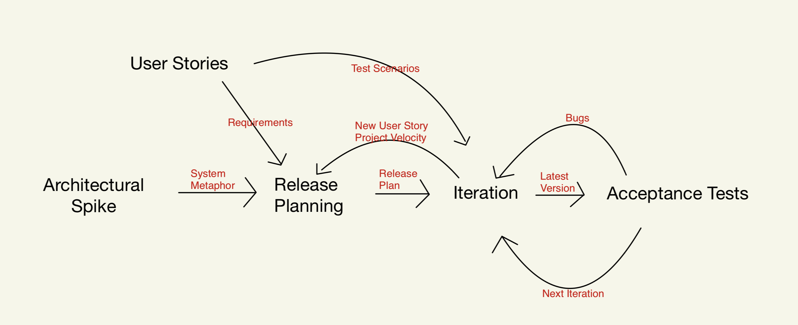

## **Project Scope**

### Software Development Life Cycle Model

In this project, a mix of Scrum and XP will be adopted. The following paragraph describes the flow:

Before each release, the development team would go through a cycle in the diagram above. While each morning,
developers would hold a short daily scrum meeting which lasts 5~15 minutes to discuss about the progress and 
difficulties faced. Each week will be defined as a semi-sprint (follow the scrum convention). At the end of
each week (Friday), a meeting will be held to adjust the gantte chart and development velocity and cater to the 
potentially capricious requirement specification.

- Product Owner: Sinopac
- Scrum Master: Simon Chu
- Development team: Eddy and Hou Rui

### User Stories

Priorities: High (must have) - `* * *`, Medium (nice to have) - `* *`, Low (unlikely to have) - `*`

| US ID | Priority | As a …                                                         | I want to …                                                                                 | So that I can…                                                                     |
| - | -------- | -------------------------------------------------------------- | ------------------------------------------------------------------------------------------- | ---------------------------------------------------------------------------------- |
| <a name="US1">1</a> | `* * *`  | TMU Sales                                                   | collect the PSR data, CRM information, and transaction history on a client call (before pick up). - **SCENARIO 1** | |
| <a name="US2">2</a> | `* * *`  | TMU Sales                                                   | collect the PSR data, CRM information, and transaction history on answering a phone for other TMU sales(after pick up). - **SCENARIO 2** | |
| <a name="US3">3</a> | `* * *`  | TMU Sales                                                   | collect the PSR data, CRM information, and transaction history on proactively barging in other TMU sales' phone call. - **SCENARIO 4** | |
| <a name="US4">4</a> | `* * *`  | TMU Sales                                                   | collect the PSR data, CRM information, and transaction history on calling out. - **SCENARIO 8** | |
| <a name="US5">5</a> | `* * *`  | TMU Sales                                                   | collect the PSR data, CRM information, and transaction history on answering a transferred call (after pick up). - **SCENARIO 9** | |
| <a name="US6">6</a> | `* * *`  | QA engineer                                                 | have a continuous testing zone | continuously integrate the entire system and test iteratively. |
| <a name="US7">7</a> | `* * *`  | QA engineer                                                 | have a minimum 75% (standard adopted in SalesForce) test coverage system | assure the quality of the system.  |
| <a name="US8">8</a> | `* * *`  | Deployment engineer                                         | have a continuous deployment workflow | build up clear deployment plan and prepare production and UAT environment. |
| <a name="US9">9</a> | `* * *`  | Deployment engineer                                         | have a configuration system | deploy the product according to a customized environment to a certain degree. |
| <a name="US10">10</a> | `* * *`  | Maintenance engineer                                        | have a log management system | perform minimum system maintenance and report logging error to the developers. |
| <a name="US11">11</a> | `* * *`  | Developer                                         | maintain an always up-to-date developer guide and documentation | debug and scale the system much more efficiently. |
| <a name="US12">12</a> | `* * *`  | Developer                                         | a static analyzer for code quality and programming style | drastically reduce the amount of effort required for vulnerability check. |

## **Work Breakdown Structure (WBS)**

| Task ID | Task                                                        | Estimated Effort        | Buffer        |
| ------- | ----------------------------------------------------------- | ------------------------| -------------- |
| 1       | Bluewave system analysis                                    |  | |     
| 1.1     | Build quick event catcher                                   | 3 man hour | 1 man hour |
| 1.2     | Organize event snippets                                     | 1 man hour | 0.5 man hour |
| 1.3     | Bluewave system consultation with the stake engineers       | 1 man hour | 0.5 man hour |
| 1.4     | Design parser and logger structure based on system analysis result (meeting required) | 3 man hour | 1 man hour |
| 2       | Backend Revamp   |||
| 2.1     | Backend re-factoring |  |  | 
| 2.1.1     | Modularize existing code into multiple components (refactoring) | 3 man hour | 1 man hour | 
| 2.2     | Backend re-design |  |  | 
| 2.2.1     | Modularize existing code into multiple components (refactoring) | 3 man hour | 1 man hour | 
| 2.2.2     | Mock stored procedure set-up | 3 man hour | 1 man hour | 
| 2.2.3     | Build backend Persistence Data structure (with stored procedure) | 2 man hour | 1 man hour | 
| 2.2.4     | Build parser and **Log strategy** | 6 man hour | 2 man hour | 
| 2.2.5     | Build Bluewave auth handler and receiver APIs | 3 man hour | 1 man hour | 
| 2.2.6     | Set up business logic component | 2 man hour | 1 man hour | 
| 2.2.6     | Arrange and structure the backend APIs, web socket, and encryption flow | 6 man hour | 2 man hour | 
| 3       | Frontend Revamp                                   |  | |   
| 3.1     | Frontend re-factoring |  |  |   
| 3.1.1     | Segregate existing code into microservices - authorization, components | 3 man hour | 1 man hour | 
| 3.1.2     | Centralize style sheets and themes | 5 man hour | 1 man hour | 
| 3.2     | Frontend re-design |  |  |   
| 3.2.1     | Build state management structure (consider to include Redux) | 6 man hour | 2 man hour | 
| 4       | Testing                                   |  | |   
| 4.1     | Backend Unit Testing                       |  | |   
| 4.1.1     | Auth component        | 1 man hour | 0.5 man hour |  
| 4.1.2     | Parser component      | 4 man hour | 1 man hour |  
| 4.1.1     | Persistence Layer component (test ORM)       | 2 man hour | 1 man hour |  
| 4.1.3     | Logic component test with Mock Database, Parser Stub, Auth Stub, and Data Stubs  | 6 man hour | 2 man hour |  
| 4.2     | Backend Integration Testing                       |  | |   
| 4.2.1   | Database + Persistence Layer (set up -> execution -> expectation -> clear up)   | 6 man hour | 2 man hour | 
| 4.2.2   | Bluewave component + Bluewave  | 2 man hour | 1 man hour |   
| 4.2.3   | **Logic** + Persistence Layer + Parser + Auth + Bluewave | 2 man hour | 1 man hour |    
| 4.2.4   | Backend API test | 6 man hour | 2 man hour |    
| 4.3     | Frontend testing              | tbd | tbd |  
| 5       | Deployment             | | |    
| 5.1     | Set up Jenkins in JyouJyou Server (possibly Docker)    | 3 man hour | 1 man hour |
| 5.2     | Set up Jenkins + Tomcat + Git CI/CD environment (including frontend and all other possible applications) | 6 man hour | 3 man hour |    
| 6       | Log management system and configuration          |  |  |  
| 6.1     | Log message parser         | 3 man hour | 1 man hour |   
| 6.2     | Response distributor       | 6 man hour | 2 man hour |   
| 6.3     | UI       | 6 man hour | 2 man hour |   
| 6.4     | Unit testing for parser and distributor       | 4 man hour | 2 man hour |   
